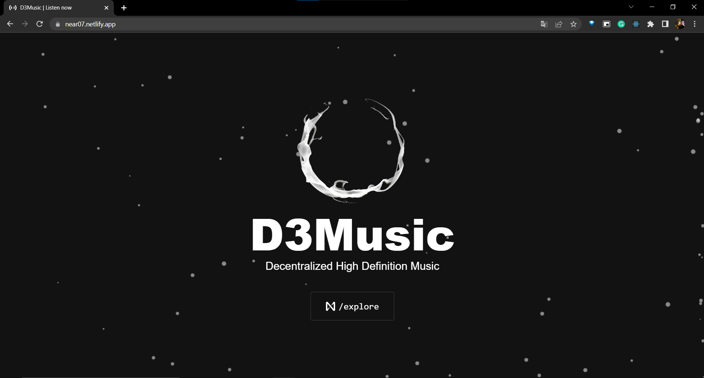
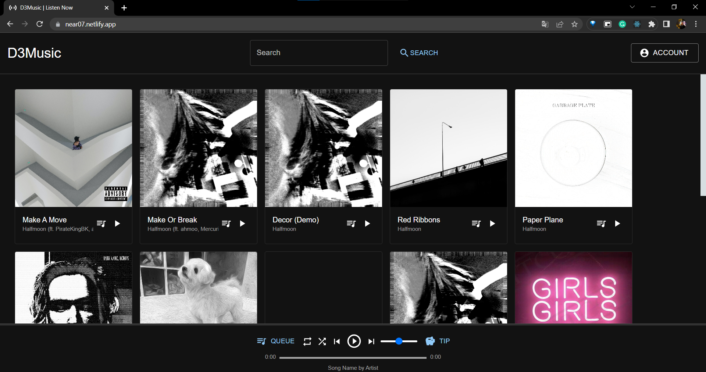
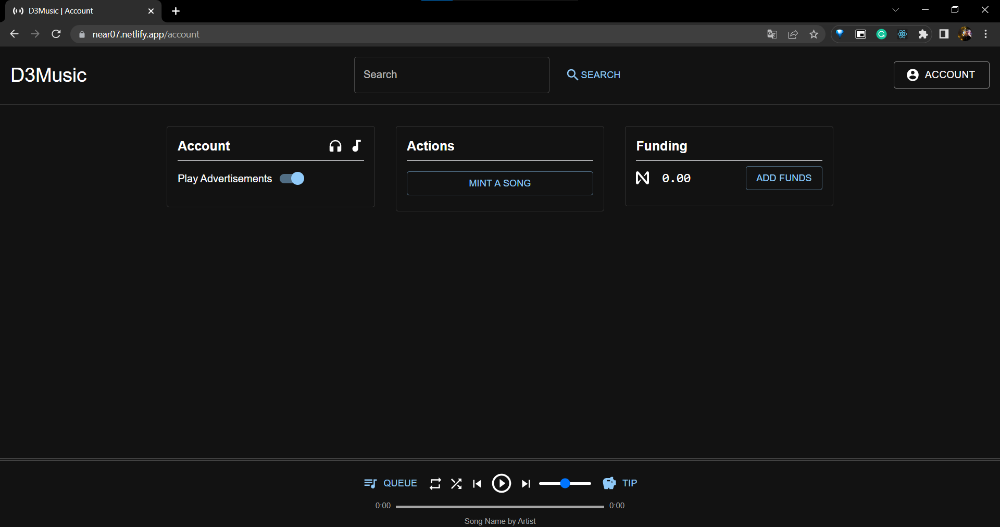
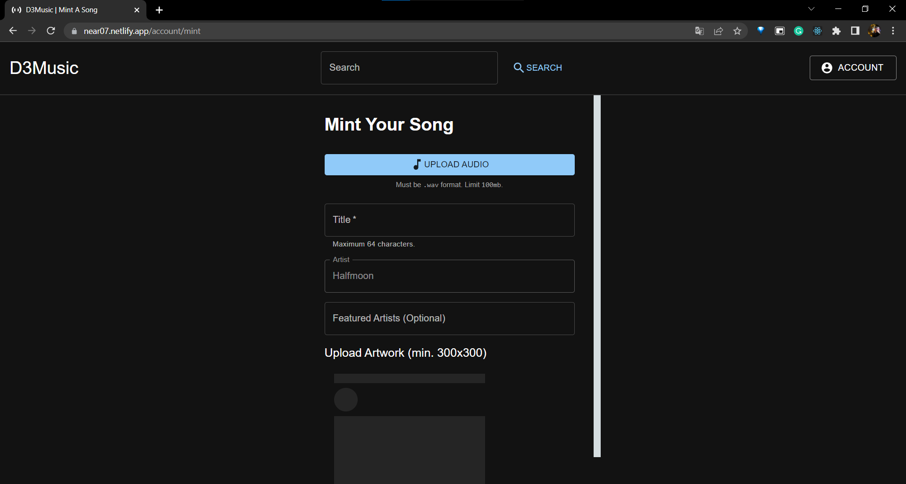

## Problem
Artists should have ownership of their music and be able to freely trade their ownership of their music.
Listeners should be able to listen to high-quality music and be able to directly support their favorite artists.
Today Web2 Apps are highly centralized they own the data of the user , User don’t have control on their data
Many Website today faces challenges of Fake Login and Bot login

## Solution
Artists can upload their music as an NFT which gives them ownership of their music
Which then can be freely traded on any NFT marketplace
They can also attach royalties to their music so that when ownership of the song is traded between owners, they get a portion of the revenue
Music is also uploaded as lossless .wav files thanks to IPFS and Filecoin providing a safe and easy way to store large files.
This allows listeners to have access to the original audio that the artist intended for them to hear. The platform also supports tipping your favorite artists with NEAR tokens, so listeners support their favorite artists directly.
Integrated with Unstoppable Domain enable with scope so the user have to share the information which is required and it is Enabled with Humanity Check so there is no Fake and Bot Login

## How It's Built
There are two parts to the applications. The frontend was built using NextJS to support a faster and easier development workflow. The backend was obviously built using NEAR protocol and I did not require any 3rd party backend.
The frontend was built using NextJS to support a faster and easier development workflow. The backend was built using NEAR protocol.

## Link to app
https://near07.netlify.app/

